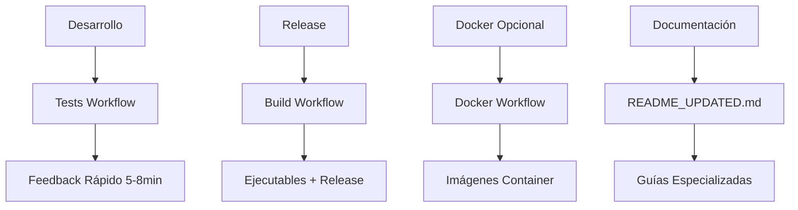

# Documentación del Proyecto Tabula Cloud Sync

Este documento describe la estructura de documentación completa y cómo los workflows de CI/CD se integran con la documentación.

## 📋 Estructura de Documentación

### Documentos Principales

1. **`README.md`** - Punto de entrada principal

   - Instalación rápida
   - Características principales
   - Uso básico y ejemplos
   - Enlaces a documentación detallada

2. **`README_UPDATED.md`** - Versión modernizada
   - Documentación completa y actualizada
   - Incluye información de CI/CD
   - Flujos de desarrollo y contribución
   - Estructura del proyecto detallada

### Documentación Especializada (`docs/`)

#### **Releases y Versionado**

- **`GITHUB_RELEASES.md`** - Estrategia de releases, versionado semántico
- **`GITHUB_ACTIONS.md`** - Workflows de CI/CD, separación de responsabilidades

#### **Configuración y Desarrollo**

- **`CONFIGURATION.md`** - Configuración general de la biblioteca
- **`SERVICE_CONFIGURATION.md`** - Configuración específica del servicio
- **`COMPILATION.md`** - Compilación a ejecutables standalone

## 🔄 Integración con CI/CD

### Workflows y Documentación

#### 1. **Workflow de Tests** (`test.yml`)

- **Propósito**: Validación rápida durante desarrollo
- **Documentación relacionada**: `GITHUB_ACTIONS.md`
- **Duración**: 5-8 minutos
- **Triggers**: Push/PR a `main` y `develop`

#### 2. **Workflow de Build** (`build.yml`)

- **Propósito**: Compilación y release de ejecutables
- **Documentación relacionada**: `GITHUB_RELEASES.md`, `COMPILATION.md`
- **Duración**: 15-20 minutos
- **Triggers**: Solo tags `v*`

#### 3. **Workflow de Docker** (`docker-optional.yml`)

- **Estado**: Opcional (deshabilitado por defecto)
- **Propósito**: Publicar imágenes Docker
- **Documentación relacionada**: `GITHUB_ACTIONS.md`
- **Para habilitar**: Renombrar a `docker.yml`

### Filosofía de Separación

## 📖 Estrategia de Documentación

### **Para Usuarios Finales**

- **README.md**: Instalación rápida con ejecutables precompilados
- **GITHUB_RELEASES.md**: Cómo descargar y verificar releases

### **Para Desarrolladores**

- **README_UPDATED.md**: Documentación completa de desarrollo
- **GITHUB_ACTIONS.md**: CI/CD y workflows
- **COMPILATION.md**: Compilación local

### **Para Mantenedores**

- **GITHUB_RELEASES.md**: Estrategia de releases
- **GITHUB_ACTIONS.md**: Configuración de workflows

## 🎯 Principios de Documentación

### 1. **Accesibilidad**

- Múltiples puntos de entrada según audiencia
- Instrucciones paso a paso
- Ejemplos prácticos

### 2. **Mantenibilidad**

- Documentación modular
- Referencias cruzadas
- Actualización automática con workflows

### 3. **Escalabilidad**

- Estructura clara y extensible
- Separación de responsabilidades
- Facilidad para agregar nueva documentación

## 🔧 Herramientas y Tecnologías

### **CI/CD**

- **GitHub Actions**: Workflows automatizados
- **GitHub Releases**: Distribución de ejecutables
- **GitHub Container Registry**: Imágenes Docker (opcional)

### **Calidad de Código**

- **pytest**: Testing unitario
- **black**: Formateo de código
- **isort**: Organización de imports
- **flake8**: Linting y verificaciones

### **Compilación**

- **PyInstaller**: Ejecutables standalone
- **Docker**: Containerización
- **GitHub Actions Matrix**: Compilación multiplataforma

## 📊 Flujo de Documentación

### **Desarrollo Normal**

1. Actualizar documentación relevante
2. Push/PR trigger tests workflow
3. Validación rápida (5-8 min)
4. Merge si todo está OK

### **Release Process**

1. Actualizar CHANGELOG.md
2. Crear tag `v*`
3. Build workflow crea ejecutables
4. Release automática con documentación incluida

### **Documentación Especializada**

1. Editar archivos en `docs/`
2. Probar localmente
3. PR para revisión
4. Integración automática

## 🚀 Evolución Futura

### **Próximas Mejoras**

- Documentación interactiva con GitHub Pages
- Tests de documentación automatizados
- Integración con herramientas de cobertura
- Documentación de API automática

### **Extensibilidad**

- Fácil adición de nuevos workflows
- Documentación modular
- Integración con más plataformas de distribución

---

**Esta estructura de documentación garantiza una experiencia coherente para todos los tipos de usuarios, desde usuarios finales hasta contribuidores del proyecto.**
